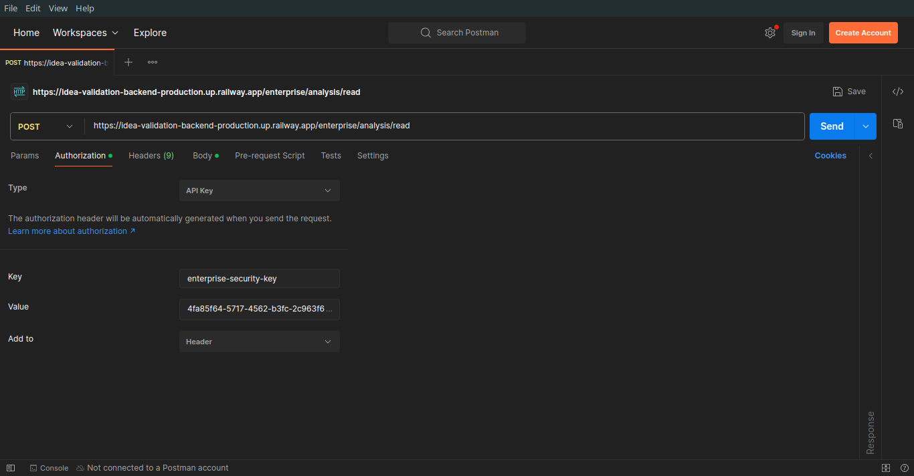
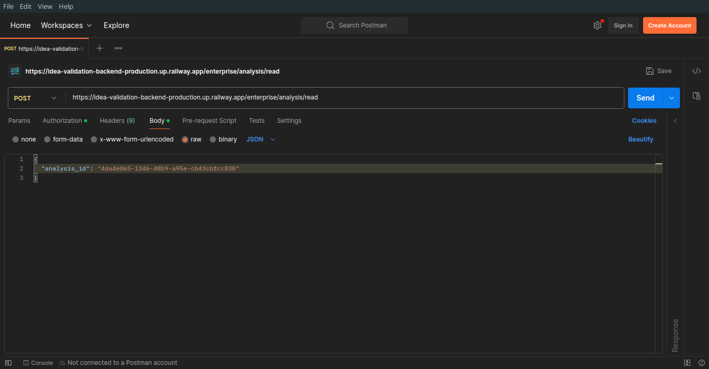
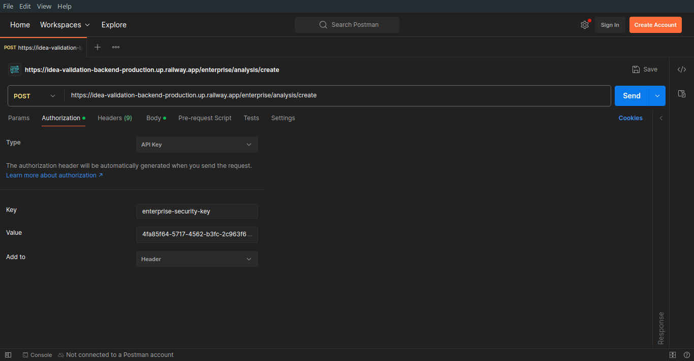
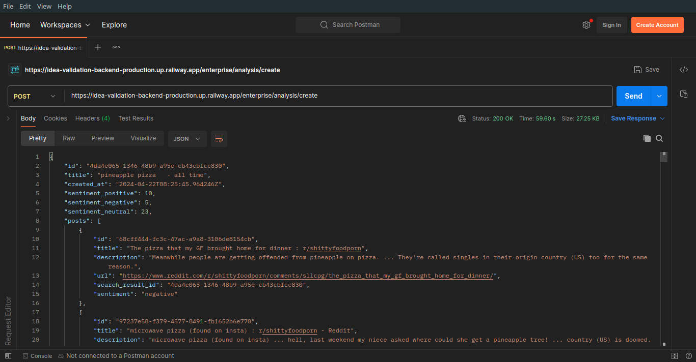
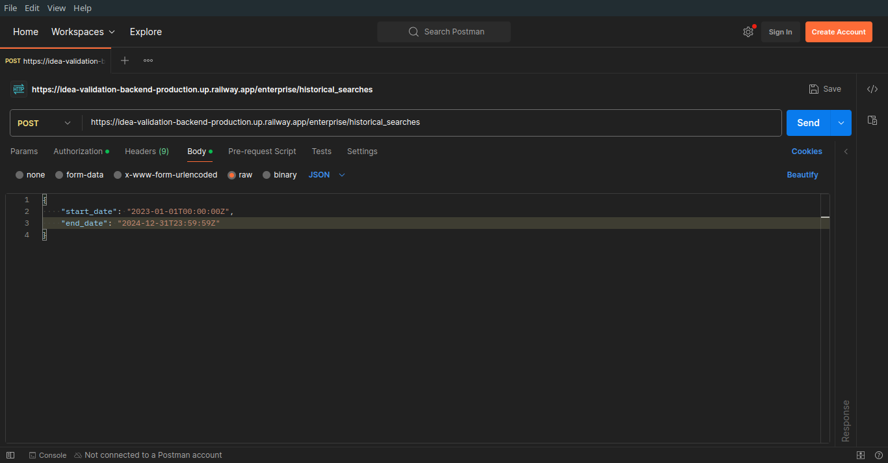
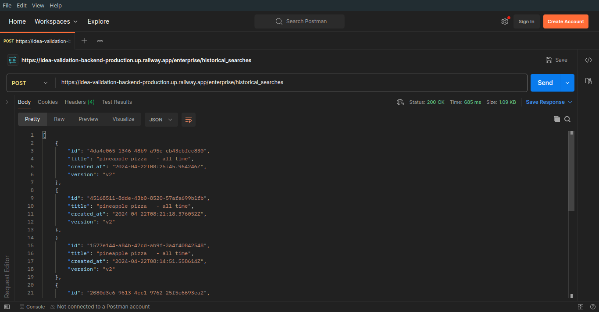
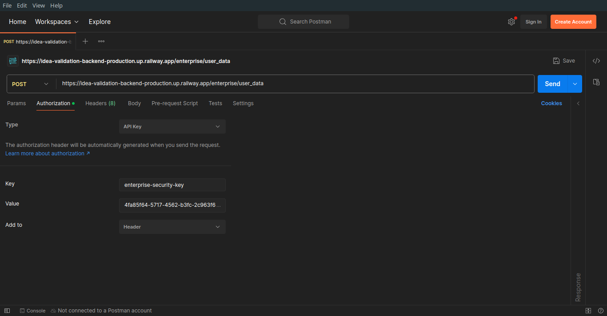

# IdeaApe Enterprise API

# Read Analysis
POST `/enterprise/analysis/read`

This endpoint is used to read the analysis results for a given analysis ID. It requires an API key and an Enterprise-security-key for authorization.

## Expected Input
The expected input is a JSON object with the following properties:

- `analysis_id`: A string that represents the ID of the analysis to be read.

### Sample Input
```javascript
{
  "analysis_id": "3fa85f64-5717-4562-b3fc-2c963f66afa6"
}
```

## Expected Output
- The expected output is a `SearchResult` objeect.
- If the API key is not found in the database, a 403 Unauthorized user error will be returned.
- If the analysis ID is not found, a 404 Analysis not found error will be returned.

### Sample Request 
> Make sure to add `enterprise-security-key` in the headers.

**JavaScript**
```javascript
const ENTERPRISE_SECURITY_KEY = 'XXXXXXXX-XXXX-XXXX-XXXX-XXXXXXXXXXXX';
const analysisId = 'XXXXXXXX-XXXX-XXXX-XXXX-XXXXXXXXXXXX';

async function readAnalysis() {
    fetch('https://idea-validation-backend-production.up.railway.app/enterprise/analysis/read', {
        method: 'POST',
        headers: {
            'accept': 'application/json',
            'enterprise-security-key': ENTERPRISE_SECURITY_KEY,
            'Content-Type': 'application/json'
        },
        body: JSON.stringify({
            analysis_id: analysisId,
        })
    })
        .then(response => response.json())
        .then(data => {
            // Handle the response data
            console.log(data);
        })
        .catch(error => {
            // Handle any errors
            console.error('Error:', error);
        });
}

readAnalysis();
```

**curl**
```curl
curl -X 'POST' \
  'https://idea-validation-backend-production.up.railway.app/enterprise/analysis/read' \
  -H 'accept: application/json' \
  -H 'enterprise-security-key: API_KEY' \
  -H 'Content-Type: application/json' \
  -d '{
  "analysis_id": "3fa85f64-5717-4562-b3fc-2c963f66afa6"
}'
```

**Postman**
* 
* 


### Sample Response
```javascript
{
  "id": "3fa85f64-5717-4562-b3fc-2c963f66afa6",
  "title": "string",
  "created_at": "2024-04-20T12:47:14.069Z",
  "sentiment_positive": 0,
  "sentiment_negative": 0,
  "sentiment_neutral": 0,
  "posts": [
    {
      "id": "3fa85f64-5717-4562-b3fc-2c963f66afa6",
      "title": "string",
      "description": "string",
      "url": "string",
      "search_result_id": "3fa85f64-5717-4562-b3fc-2c963f66afa6",
      "sentiment": "positive"
    }
  ],
  "analyses": [
    {
      "persona": {
        "id": "3fa85f64-5717-4562-b3fc-2c963f66afa6",
        "persona_text": "string",
        "post_ids": [
          "3fa85f64-5717-4562-b3fc-2c963f66afa6"
        ],
        "llm": "gpt4",
        "icon_id": "string",
        "search_result_id": "3fa85f64-5717-4562-b3fc-2c963f66afa6"
      },
      "painpoints": [
        {
          "id": "3fa85f64-5717-4562-b3fc-2c963f66afa6",
          "painpoint_text": "string",
          "post_ids": [
            "3fa85f64-5717-4562-b3fc-2c963f66afa6"
          ],
          "llm": "gpt4",
          "persona_id": "3fa85f64-5717-4562-b3fc-2c963f66afa6"
        }
      ],
      "summary": {
        "id": "3fa85f64-5717-4562-b3fc-2c963f66afa6",
        "summary_text": "string",
        "bulleted_list": [
          "string"
        ],
        "llm": "gpt4"
      }
    }
  ],
  "icons": [
    {
      "id": "string",
      "name": "string",
      "content": "string"
    }
  ]
}
```

**Postman Response**
* 

---
---

# Create Analysis
POST `/enterprise/analysis/create`

This endpoint is used to create a new analysis based on a given search query, country, and date filter. It requires an API key and an Enterprise-security-key for authorization.

## Expected Input
The expected input is a JSON object with the following properties:

- `search_query`: A string that represents the search query for the analysis.
- `country`: A string that represents the country filter for the analysis. It should be one of the values defined in the [`CountriesLiteral`](./data/countrties_literal.txt) enum.
- `date_filter`: A string that represents the date filter for the analysis. It should be one of the values defined in the [`DateFilterLiteral`](./data//date_filter_literal.txt) enum.

### Sample Input
```javascript
{
  "search_query": "pineapple pizza",
  "country": "us",
  "date_filter": "all",
}
```

## Expected Output
- The expected output is a SearchResult object.
- If the API key is not found in the database, a 403 Unauthorized user error will be returned.

### Sample Request
> Make sure to add `enterprise-security-key` in the headers along with `api_key` in the request body.

**JavaScript**
```javascript
const ENTERPRISE_SECURITY_KEY = 'XXXXXXXX-XXXX-XXXX-XXXX-XXXXXXXXXXXX';

async function createAnalysis() {
    fetch('https://idea-validation-backend-production.up.railway.app/enterprise/analysis/create', {
        method: 'POST',
        headers: {
            'accept': 'application/json',
            'enterprise-security-key': ENTERPRISE_SECURITY_KEY,
            'Content-Type': 'application/json'
        },
        body: JSON.stringify({
            search_query: 'pineapple pizza',
            country: 'us',
            date_filter: 'all',
        })
    })
        .then(response => response.json())
        .then(data => {
            // Handle the response data
            console.log(data);
        })
        .catch(error => {
            // Handle any errors
            console.error('Error:', error);
        });
}

createAnalysis();
```

**curl**
```curl
curl -X 'POST' \
  'https://idea-validation-backend-production.up.railway.app/enterprise/analysis/create' \
  -H 'accept: application/json' \
  -H 'enterprise-security-key: API_KEY' \
  -H 'Content-Type: application/json' \
  -d '{
  "search_query": "pineapple pizza",
  "country": "us",
  "date_filter": "all"
}'
```

**Postman**
* 
* 

### Sample Response
```javascript
{
  "id": "3fa85f64-5717-4562-b3fc-2c963f66afa6",
  "title": "string",
  "created_at": "2024-04-20T12:47:14.069Z",
  "sentiment_positive": 0,
  "sentiment_negative": 0,
  "sentiment_neutral": 0,
  "posts": [
    {
      "id": "3fa85f64-5717-4562-b3fc-2c963f66afa6",
      "title": "string",
      "description": "string",
      "url": "string",
      "search_result_id": "3fa85f64-5717-4562-b3fc-2c963f66afa6",
      "sentiment": "positive"
    }
  ],
  "analyses": [
    {
      "persona": {
        "id": "3fa85f64-5717-4562-b3fc-2c963f66afa6",
        "persona_text": "string",
        "post_ids": [
          "3fa85f64-5717-4562-b3fc-2c963f66afa6"
        ],
        "llm": "gpt4",
        "icon_id": "string",
        "search_result_id": "3fa85f64-5717-4562-b3fc-2c963f66afa6"
      },
      "painpoints": [
        {
          "id": "3fa85f64-5717-4562-b3fc-2c963f66afa6",
          "painpoint_text": "string",
          "post_ids": [
            "3fa85f64-5717-4562-b3fc-2c963f66afa6"
          ],
          "llm": "gpt4",
          "persona_id": "3fa85f64-5717-4562-b3fc-2c963f66afa6"
        }
      ],
      "summary": {
        "id": "3fa85f64-5717-4562-b3fc-2c963f66afa6",
        "summary_text": "string",
        "bulleted_list": [
          "string"
        ],
        "llm": "gpt4"
      }
    }
  ],
  "icons": [
    {
      "id": "string",
      "name": "string",
      "content": "string"
    }
  ]
}
```

**Postman Response**
* 

---
---

# Historical Searches
POST `/enterprise/historical_searches`

This endpoint is used to retrieve the historical searches performed within a specified date range. It requires an API key and an Enterprise-security-key for authorization.

## Expected Input
The expected input is a JSON object with the following properties:

- `start_date`: A string that represents the start date of the date range in ISO 8601 format (e.g., "2023-01-01T00:00:00Z").
- `end_date`: A string that represents the end date of the date range in ISO 8601 format (e.g., "2023-12-31T23:59:59Z").

### Sample Input
```javascript
{
  "start_date": "2023-01-01T00:00:00Z",
  "end_date": "2023-12-31T23:59:59Z"
}
```

## Expected Output
- The expected output is an array of `SearchResultHistoryOutput` objects.
- Each `SearchResultHistoryOutput` object contains the following properties:
  - `id`: A UUID that represents the unique identifier of the search result.
  - `title`: A string that represents the title of the search result.
  - `created_at`: A string that represents the creation date and time of the search result in ISO 8601 format.
  - `version`: A string that represents the version of the search result. It should be one of the values defined in the VersionsLiteral enum.
- If the API key is not found in the database, a 403 Unauthorized user error will be returned.

### Sample Request
> Make sure to add enterprise-security-key in the headers.

**JavaScript**
```javascript
const ENTERPRISE_SECURITY_KEY = 'XXXXXXXX-XXXX-XXXX-XXXX-XXXXXXXXXXXX';

async function readAnalysis() {
    fetch('https://idea-validation-backend-production.up.railway.app/enterprise/historical_searches', {
        method: 'POST',
        headers: {
            'accept': 'application/json',
            'enterprise-security-key': ENTERPRISE_SECURITY_KEY,
            'Content-Type': 'application/json'
        },
        body: JSON.stringify({
            start_date: "2023-01-01T00:00:00Z",
            end_date: "2024-12-31T23:59:59Z"
        })
    })
        .then(response => response.json())
        .then(data => {
            // Handle the response data
            console.log(data);
        })
        .catch(error => {
            // Handle any errors
            console.error('Error:', error);
        });
}

readAnalysis();
```

**curl**
```curl
curl -X 'POST' \
  'https://idea-validation-backend-production.up.railway.app/enterprise/historical_searches' \
  -H 'accept: application/json' \
  -H 'enterprise-security-key: API_KEY' \
  -H 'Content-Type: application/json' \
  -d '{
  "start_date": "2023-01-01T00:00:00Z",
  "end_date": "2024-12-31T23:59:59Z"
}'
```

**Postman**
* 
* 

### Sample Response
```javascript
[
  {
    "id": "3fa85f64-5717-4562-b3fc-2c963f66afa6",
    "title": "string",
    "created_at": "2023-05-01T10:30:00Z",
    "version": "v1"
  },
  {
    "id": "2e8a6ac8-1234-5678-90ab-cdef01234567",
    "title": "another string",
    "created_at": "2023-07-15T18:45:30Z",
    "version": "v2"
  }
]
```

**Postman Response**
* 


# User Data (API credits remaining and other details )
POST `/enterprise/user_data`

This endpoint is used to retrieve the user data associated with the provided API key. It requires an API key and an Enterprise-security-key for authorization.

## Expected Input
Nothing is needed as input, based on the `enterprise-security-key` sent in the headers the details will be fetched.


## Expected Output
- The expected output is an `EnterpriseUserData` object.
- The `EnterpriseUserData` object contains the following properties:
  - `plans`: An array of `PlansStatus` objects representing the plans associated with the user.
    - Each `PlansStatus` object contains the following properties:
      - `plan_name`: A string representing the name of the plan.
      - `subscription_id`: A string representing the unique identifier of the subscription.
      - `credits_total`: An integer representing the total number of credits allocated to the plan.
      - `credits_used`: An integer representing the number of credits used in the plan.
      - `created_at`: A string representing the creation date and time of the plan in ISO 8601 format.
      - `expires_at`: A string representing the expiration date and time of the plan in ISO 8601 format.
  - `searches_allowed` : An integer representing the total number of searches allowed for the user.
  - `searches_used`: An integer representing the number of searches used by the user.
  - `searches_remaining`: An integer representing the number of searches remaining for the user.
- If the API key is not found in the database, a 403 Unauthorized user error will be returned.

### Sample Request
> Make sure to add enterprise-security-key in the headers.

**JavaScript**
```javascript
const ENTERPRISE_SECURITY_KEY = 'XXXXXXXX-XXXX-XXXX-XXXX-XXXXXXXXXXXX';

async function fetchUserData() {
    fetch('https://idea-validation-backend-production.up.railway.app/enterprise/user_data', {
        method: 'POST',
        headers: {
            'accept': 'application/json',
            'enterprise-security-key': ENTERPRISE_SECURITY_KEY,
            'Content-Type': 'application/json'
        }
    })
        .then(response => response.json())
        .then(data => {
            // Handle the response data
            console.log(data);
        })
        .catch(error => {
            // Handle any errors
            console.error('Error:', error);
        });
}

fetchUserData();
```

**curl**
```curl
curl -X 'POST' \
  'https://idea-validation-backend-production.up.railway.app/enterprise/user_data' \
  -H 'accept: application/json' \
  -H 'enterprise-security-key: API_KEY' \
  -H 'Content-Type: application/json' 
```

**Postman**
* 

> Body is empty for `/enterprise/user_data`

### Sample Response
```javascript
{
  "plans": [
    {
      "plan_name": "Basic",
      "subscription_id": "sub_123456789",
      "credits_total": 1000,
      "credits_used": 500,
      "created_at": "2023-01-01T00:00:00Z",
      "expires_at": "2023-12-31T23:59:59Z"
    },
    {
      "plan_name": "Pro",
      "subscription_id": "sub_987654321",
      "credits_total": 5000,
      "credits_used": 0,
      "created_at": "2024-01-01T00:00:00Z",
      "expires_at": "2024-12-31T23:59:59Z"
    }
  ],
  "searches_allowed": 6000,
  "searches_used": 500,
  "searches_remaining": 5500
}
```

**Postman Response**
* 
